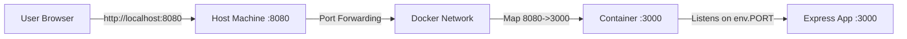
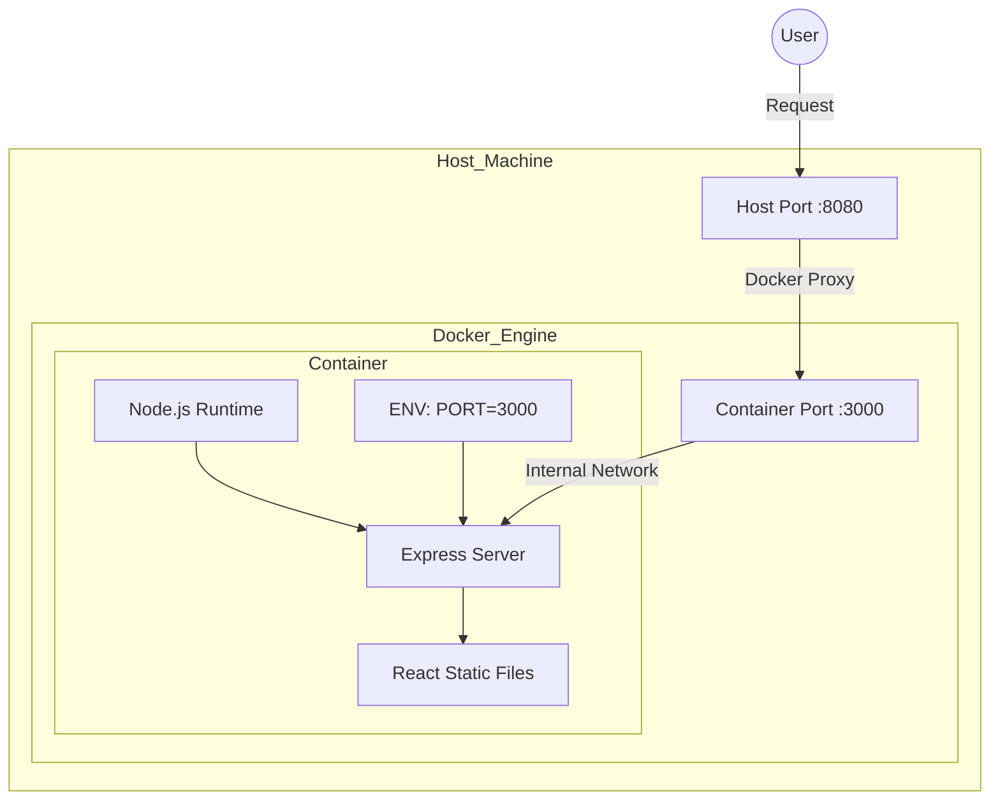

# E-Commerce Antigravity

A simple and clean **React + Vite e-commerce application** containerized with **Docker** and orchestrated with **Docker Compose**, properly automated with **GitHub Actions**.

---

## Project Overview

This application is a minimal e-commerce frontend served by an **Express.js** backend. The backend handles API endpoints and serves the static frontend assets.

**Key Features:**
- **Frontend**: React + Vite (Product listing, Cart, etc.)
- **Backend**: Node.js Express (Serving static files + API endpoints `/` and `/health`)
- **Containerization**: Docker (Multi-stage build)
- **Orchestration**: Docker Compose
- **CI/CD**: GitHub Actions (Build, Test, Push to Docker Hub)

---

## How to Run the App Without Docker

To run the application locally (requires Node.js installed):

1. **Install dependencies:**
   ```sh
   npm install
   ```
2. **Build the frontend:**
   ```sh
   npm run build
   ```
3. **Start the Express server:**
   ```sh
   # You MUST set the PORT environment variable
   export PORT=3000   # Linux/Mac
   set PORT=3000      # Windows CMD
   $env:PORT=3000     # Windows PowerShell

   npm start
   ```
   The app will be available at [http://localhost:3000](http://localhost:3000).

---

## How to Run with Docker Compose (Recommended)

This is the preferred way to run the application as it ensures a consistent environment.

1. **Start the application:**
   ```sh
   docker-compose up --build
   ```

2. **Access the application:**
   - **Frontend/API**: [http://localhost:8080](http://localhost:8080)
   - **Health Check**: [http://localhost:8080/health](http://localhost:8080/health)

To stop the application:
```sh
docker-compose down
```

---

## Ports & Networking Explanation

The application involves three distinct layers of networking ports:

1.  **Application Port (Container Internal)**:
    - This is the port the Express server listens on **inside** the container.
    - It is determined by the `PORT` environment variable passed to the container.
    - In our setup, this is set to `3000` via `docker-compose.yml`.

2.  **Container Port (Docker Exposed)**:
    - This is the port exposed by the Docker container to the Docker network.
    - It matches the Application Port (`3000`).

3.  **Host Port (External Access)**:
    - This is the port on your physical machine (localhost) that maps to the Container Port.
    - In `docker-compose.yml`, we map Host Port `8080` to Container Port `3000`.

**Traffic Flow:**


**Why are Host and Container ports different?**
- **Security & Conflict Avoidance**: You might run multiple apps inside Docker that all want to listen on port 3000. By mapping them to different host ports (e.g., 8080, 8081), you avoid conflicts on your host machine while keeping the internal configuration simple.

**Application Logic**:
- The `/` endpoint returns the port the *application believes* it is running on (`3000`). This confirms the environment variable injection was successful.

---

## CI Pipeline Explanation

The project uses **GitHub Actions** located in `.github/workflows/ci.yml`.

### Pipeline Steps:

1.  **Build & Test Job**:
    - **Checkout**: Pulls the code.
    - **Build Docker Image**: Builds the image locally to ensure `Dockerfile` validity.
    - **Run Verification**: Starts a detached container and performs `curl` requests against `http://localhost:8080/health` and `/` to ensure the app is responsive.
    - **Cleanup**: Stops and removes the test container.

2.  **Push to Hub Job**:
    - Runs only if the Test job passes and the push is to `main`.
    - **Login**: Authenticates with Docker Hub using repository Secrets (`DOCKER_USERNAME`, `DOCKER_PASSWORD`).
    - **Build & Push**: Builds the image again (cached) and pushes it to Docker Hub with two tags:
        - `:latest`
        - `:<commit-sha>` (for versioning)

---

## Decisions & Tradeoffs

1.  **Multi-Stage Docker Build**:
    - **Decision**: Used a multi-stage build (Builder -> Runner).
    - **Reason**: To keep the final image size small. The React build tools and source code are not needed in production, only the `dist` folder and the Express server.
    - **Tradeoff**: Slightly more complex Dockerfile, but results in a much more efficient and secure production image.

2.  **Express Backend Wrapper**:
    - **Decision**: Wrapped the React app in a custom Express server instead of using Nginx or serving strictly from S3/CDN.
    - **Reason**: The requirements explicitly mandated reading a `PORT` variable and exposing specific API endpoints (`/health` returning specific JSON). Nginx can do this but requires more complex configuration for dynamic Logic. Express is native to the ecosystem.
    - **Tradeoff**: Adds a Node.js runtime overhead to the container compared to a pure Nginx static serve.

3.  **Strict Port Handling**:
    - **Decision**: The app crashes (`process.exit(1)`) if `PORT` is not set.
    - **Reason**: To strictly adhere to the requirement "Fail clearly if the port variable is not set".
    - **Tradeoff**: Reduces developer convenience (must set ENV to run), but increases operational certainty that configuration is correct.

---

## Architecture Diagram

